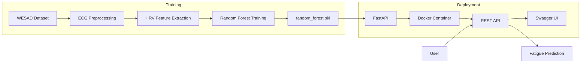

# ECG-Based Fatigue Detection using Machine Learning


A machine learning project for detecting fatigue from Electrocardiogram (ECG) signals using Heart Rate Variability (HRV) features and a Random Forest classifier. The project includes ECG preprocessing, HRV feature extraction, model training, evaluation, and deployment as a REST API using FastAPI and Docker.

---

## Project Overview

Fatigue can negatively affect human performance, concentration, and safety. Physiological signals such as Electrocardiogram (ECG) provide valuable information about the autonomic nervous system, making them useful for fatigue detection.

This project processes raw ECG recordings, extracts Heart Rate Variability (HRV) features, trains a Random Forest classifier, and exposes the trained model through a FastAPI REST API. The application is fully containerized using Docker, making it easy to deploy and reproduce.

---

## Features

- ECG signal preprocessing
- Butterworth band-pass filtering
- R-peak detection
- RR interval computation
- HRV feature extraction
- Random Forest classifier
- Model evaluation
- FastAPI REST API
- Interactive Swagger documentation
- Docker containerization

## Project Architecture



## Dataset

This project uses the **WESAD (Wearable Stress and Affect Detection)** dataset.

The dataset contains multimodal physiological recordings, including ECG, collected from participants under different affective states.

Only ECG recordings were used for this project to compute Heart Rate Variability (HRV) features for fatigue detection.

> **Note:** The WESAD dataset is not included in this repository due to licensing restrictions.

## Project Structure

```text
ecg-fatigue-detection/
│
├── data/
│
├── figures/
│
├── models/
│   └── random_forest.pkl
│
├── notebook/
│   ├── 01_data_exploration.ipynb
│   └── 02_training_pipeline.ipynb
│
├── src/
│   ├── __init__.py
│   ├── config.py
│   ├── dataset.py
│   ├── evaluate.py
│   ├── hrv_features.py
│   ├── predict.py
│   ├── preprocessing.py
│   └── train.py
│
├── .dockerignore
├── .env
├── .gitignore
├── app.py
├── docker-compose.yml
├── Dockerfile
├── README.md
├── requirements.txt
└── requirements-docker.txt
```

## Technologies Used

- Python 3.12
- FastAPI
- Scikit-learn
- Pandas
- NumPy
- NeuroKit2
- Docker
- Docker Compose
- Uvicorn

## Installation

### 1. Clone the repository

```bash
git clone https://github.com/ArbaazK809/ecg-fatigue-detection.git

cd ecg-fatigue-detection
```

### 2. Create a virtual environment

Windows

```bash
python -m venv .venv
.venv\Scripts\activate
```

Linux / macOS

```bash
python3 -m venv .venv
source .venv/bin/activate
```

### 3. Install dependencies

```bash
pip install -r requirements.txt
```

### 4. Run the API

```bash
uvicorn app:app --reload
```

Open your browser:

```
http://localhost:8000
```

Swagger Documentation:

```
http://localhost:8000/docs
```

## Docker Deployment

### Build the Docker image

```bash
docker build -t ecg-fatigue-api .
```

### Run the container

```bash
docker run -d -p 8000:8000 --name ecg-fatigue-container ecg-fatigue-api
```

Or using Docker Compose

```bash
docker compose up
```

Swagger UI

```
http://localhost:8000/docs
```

## API Usage

### API Endpoints

| Method | Endpoint | Description |
|---------|----------|-------------|
| GET | `/` | Health check endpoint |
| POST | `/predict` | Predict fatigue level from HRV features |

Example Request

```json
{
  "Mean_RR": 0.82,
  "Mean_HR": 73.2,
  "SDNN": 42.5,
  "RMSSD": 35.8,
  "Min_RR": 0.65,
  "Max_RR": 1.12,
  "Median_RR": 0.81
}
```

Example Response

```json
{
  "fatigue_level": 0,
  "prediction": "No Fatigue"
}
```

## Screenshots

### Swagger UI


---

### Prediction Example


---

### Docker Container


## Project Outcome

The ECG Fatigue Detection system was successfully developed and deployed as a RESTful API.

### Achievements

- Successfully preprocessed ECG data from the WESAD dataset.
- Extracted Heart Rate Variability (HRV) features for fatigue classification.
- Trained a Random Forest classifier.
- Saved the trained model as `random_forest.pkl`.
- Developed a FastAPI application for real-time predictions.
- Containerized the application using Docker.
- Successfully tested the API using Swagger UI.
- The API accepts HRV features as input and returns fatigue predictions in JSON format.

### Sample Prediction

**Input**

```json
{
  "Mean_RR": 0.82,
  "Mean_HR": 73.2,
  "SDNN": 42.5,
  "RMSSD": 35.8,
  "Min_RR": 0.65,
  "Max_RR": 1.12,
  "Median_RR": 0.81
}
```

**Output**

```json
{
  "fatigue_level": 0,
  "prediction": "No Fatigue"
}
```

## Future Improvements

- Real-time ECG streaming
- Additional machine learning models
- Deep learning comparison
- Cloud deployment
- Web dashboard
- Model monitoring

## License

This project is licensed under the MIT License.

See the LICENSE file for more details.

