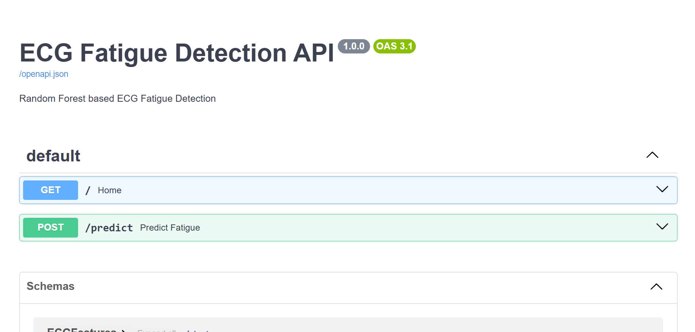
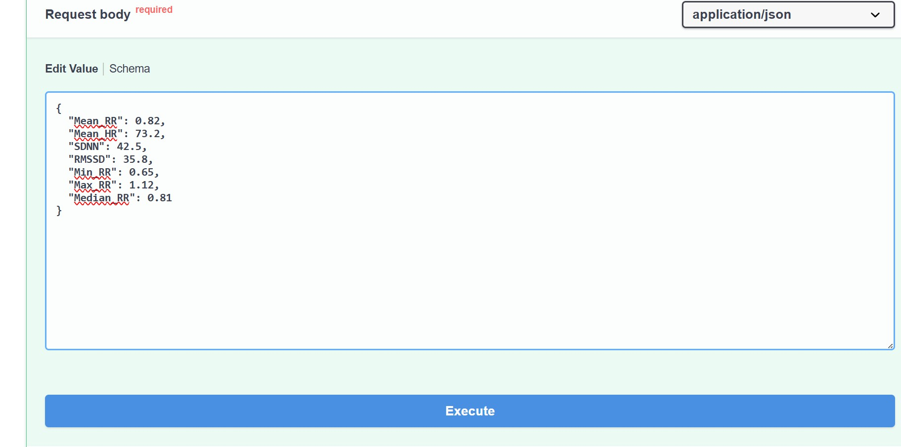
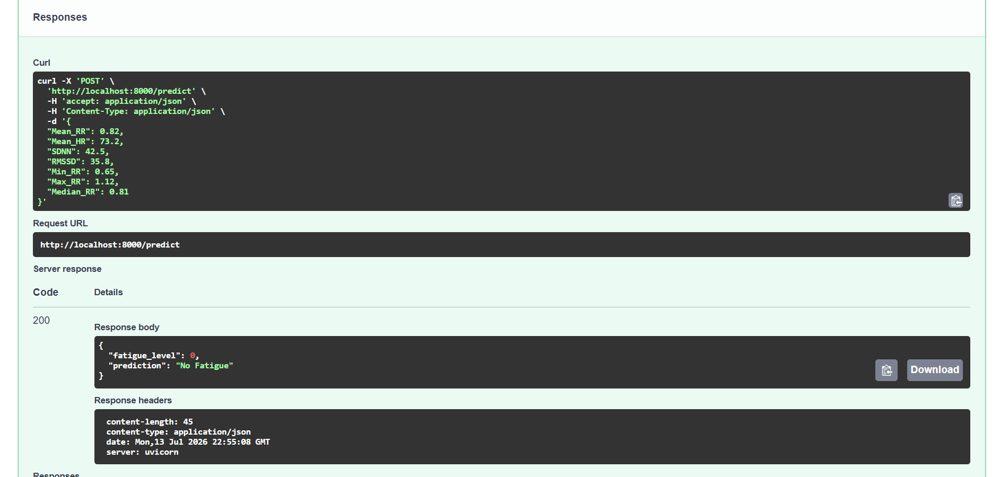
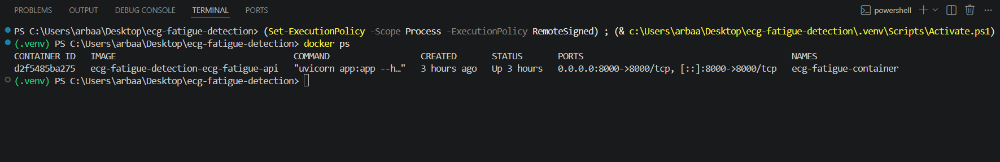

🇬🇧 **English Version:** [README.md](README.md)

# ECG-basierte Müdigkeitserkennung mit Machine Learning


## Projektübersicht

Dieses Projekt implementiert ein Machine-Learning-System zur Erkennung von Müdigkeit anhand von Elektrokardiogramm-(ECG)-Signalen. Aus den ECG-Daten werden Herzfrequenzvariabilitäts-(HRV)-Merkmale extrahiert und mit einem Random-Forest-Klassifikator analysiert.

Das trainierte Modell wurde als RESTful API mit FastAPI bereitgestellt und mithilfe von Docker containerisiert, um eine einfache Bereitstellung und Reproduzierbarkeit zu ermöglichen.

---

## Hauptfunktionen

- Vorverarbeitung von ECG-Daten
- Extraktion von HRV-Merkmalen
- Random-Forest-Klassifikation
- REST API mit FastAPI
- Interaktive Swagger-API-Dokumentation
- Docker- und Docker-Compose-Unterstützung
- Bereit für lokale oder Cloud-Bereitstellung

---

## Verwendete Technologien

- Python 3.12
- FastAPI
- Scikit-learn
- Pandas
- NumPy
- Docker
- Docker Compose
- Uvicorn
- Swagger UI

---

## Datensatz

Für dieses Projekt wurde der WESAD-Datensatz verwendet.

Der Datensatz enthält physiologische Signale, darunter ECG-Daten, zur Analyse von Stress und Müdigkeit.

---

## Projektstruktur

```text
ecg-fatigue-detection/
│
├── data/
├── figures/
├── models/
│   └── random_forest.pkl
│
├── notebook/
│   ├── 01_data_exploration.ipynb
│   └── 02_training_pipeline.ipynb
│
├── src/
│   ├── config.py
│   ├── dataset.py
│   ├── preprocessing.py
│   ├── hrv_features.py
│   ├── train.py
│   ├── evaluate.py
│   └── predict.py
│
├── app.py
├── Dockerfile
├── docker-compose.yml
├── requirements.txt
├── requirements-docker.txt
└── README_DE.md
```

---

## Projektarchitektur

```
ECG-Signal
      │
      ▼
Vorverarbeitung
      │
      ▼
HRV-Merkmalsextraktion
      │
      ▼
Random-Forest-Modell
      │
      ▼
FastAPI
      │
      ▼
REST API
      │
      ▼
Docker Container
```

---

## Installation

### Repository klonen

```bash
git clone https://github.com/ArbaazK809/ecg-fatigue-detection.git
cd ecg-fatigue-detection
```

### Abhängigkeiten installieren

```bash
pip install -r requirements.txt
```

### Anwendung starten

```bash
python app.py
```

oder

```bash
uvicorn app:app --reload
```

---

## Docker

Image erstellen

```bash
docker build -t ecg-fatigue-api .
```

Container starten

```bash
docker run -d -p 8000:8000 --name ecg-fatigue-container ecg-fatigue-api
```

oder

```bash
docker compose up
```

---

## API-Dokumentation

Nach dem Start ist die Swagger-Oberfläche verfügbar unter

```
http://localhost:8000/docs
```

---

## Beispielvorhersage

### Anfrage

```json
{
  "Mean_RR": 0.82,
  "Mean_HR": 73.2,
  "SDNN": 42.5,
  "RMSSD": 35.8,
  "Min_RR": 0.65,
  "Max_RR": 1.12,
  "Median_RR": 0.81
}
```

### Antwort

```json
{
  "fatigue_level": 0,
  "prediction": "No Fatigue"
}
```

---

## Projektergebnisse

- Erfolgreiche Vorverarbeitung der ECG-Daten
- Extraktion relevanter HRV-Merkmale
- Training eines Random-Forest-Klassifikators
- Entwicklung einer RESTful API mit FastAPI
- Erfolgreiche Containerisierung mit Docker
- Bereitstellung einer interaktiven API-Dokumentation

---

## Screenshots

### Swagger UI



### Vorhersage





### Docker Container



---

## Lizenz

Dieses Projekt dient ausschließlich zu Forschungs- und Bildungszwecken.